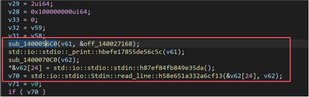
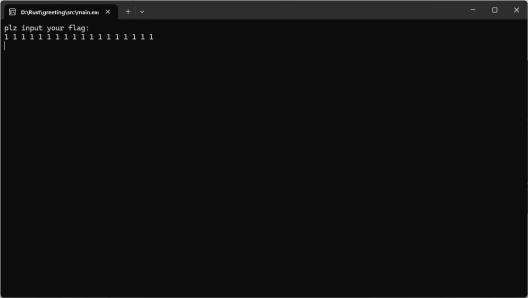
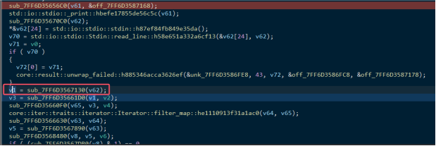
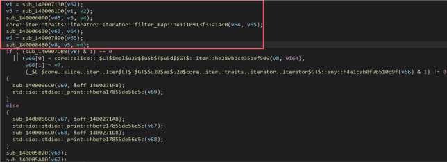
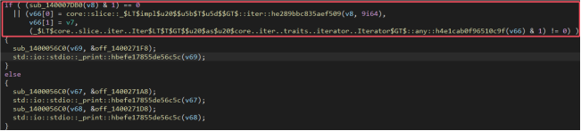
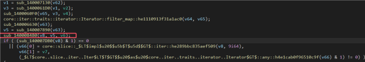
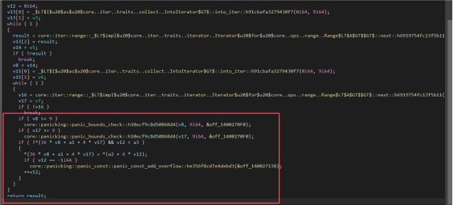
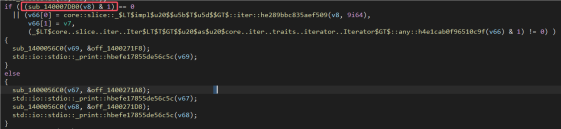

# ez_rust

> 给了pdb文件是想降低一下分析难度,确实有效减少了不必要的分析。
> 
> 首先知道这是一个数独游戏，会让我们更好的理解，当然解题的时候是需要自己分析的，wp以理解为主。

第一步先看整体代码逻辑，rust有大量的混淆ida无法自动识别，需要手动整理一下

整理完之后。



这里会打印字符串plz input your flag:

并且read_line读取输入数据的地方。

动调一下



去找出输入的数据存到了哪里，其实也就是read_line后面去找，发现存到了v1里面



这下面的意思就是对输入的数据进行处理并填充到某个位置，这里处理的是空格分割字符，比如1 11 111，这里会分割成三个数，1、11、111。然后填充到数独中。



接下来找一下填充到了哪里。其实最后是要经过check的，这是大多数题目都有的一步，那我们找到最后需要check的地方，那就是找到了填充好的表的地方。这个思路更快而且更清晰。



这里就是检查的地方，很清晰的可以看到v8，去前面看看，



跟进sub_140008480



重要的还是这一段，这里的意思就是循环判断，当36 * v8 + a1 + 4 * v17为0且v12<a3时（a3时我们输入数据的长度），会把36 * v8 + a1 + 4 * v17赋值为a2 + 4 * v12（这里a2为我们的输入，a1对应的输出）。具体为什么会以这种形式表现出来，这里放一下源码。

```rust
fn fill_sudoku(board: &mut [[i32; 9]; 9], inputs: &[i32]) {
    let mut index = 0;
    for row in 0..9 {
        for col in 0..9 {
            if board[row][col] == 0 && index < inputs.len() {
                board[row][col] = inputs[index];
                index += 1;
            }
        }
    }
}
```

因为是二维数组，所以a1的指针会以36 * v8 + a1 + 4 * v17的形式表示。

这里解释清楚后，最后一步check数独，也就是check v8，v8就是数独的表



跟进sub_14007DB0

无外乎就是判断行、列、九宫格有没有重复。

这个可以自行去分析，这里贴源码。

```rust
 fn is_valid(board: &[[i32; 9]; 9]) -> bool {
     // Check rows    for row in board.iter() {
         let mut seen = HashSet::new();
         for &value in row.iter() {
             if value != 0 && !seen.insert(value) {
                 return false;
             }
         }
     }
 
     // Check columns
     for col in 0..9 {
         let mut seen = HashSet::new();
         for row in 0..9 {
             let value = board[row][col];
             if value != 0 && !seen.insert(value) {
                 return false;
             }
         }
     }
 
     // Check 3x3 blocks
     for start_row in (0..9).step_by(3) {
         for start_col in (0..9).step_by(3) {
             let mut seen = HashSet::new();
             for i in 0..3 {
                 for j in 0..3 {
                     let value = board[start_row + i][start_col + j];
                     if value != 0 && !seen.insert(value) {
                         return false;
                     }
                 }
             }
         }
     }
 
     true
 }
```

知道v8是表之后提取其中的数据解数独就好了。

```rust
   let mut sudoku_board: [[i32; 9]; 9] = [
           [0, 0, 0, 0, 0, 1, 0, 0, 7],
           [0, 0, 0, 0, 6, 0, 0, 2, 0],
           [8, 0, 0, 9, 0, 0, 3, 0, 0],
           [0, 9, 5, 4, 0, 0, 0, 0, 3],
           [0, 0, 3, 0, 0, 0, 4, 0, 0],
           [4, 0, 0, 0, 0, 0, 0, 8, 0],
           [0, 0, 0, 0, 0, 7, 0, 0, 6],
           [0, 1, 0, 0, 2, 0, 0, 0, 0],
           [5, 0, 0, 3, 0, 0, 9, 0, 0],
       ];
```

可以用z3库求解，

> [3, 4, 6, 2, 5, 1, 8, 9, 7]
> 
> [7, 5, 9, 8, 6, 3, 1, 2, 4]
> 
> [8, 2, 1, 9, 7, 4, 3, 6, 5]
> 
> [1, 9, 5, 4, 8, 6, 2, 7, 3]
> 
> [6, 8, 3, 7, 1, 2, 4, 5, 9]
> 
> [4, 7, 2, 5, 3, 9, 6, 8, 1]
> 
> [2, 3, 8, 1, 9, 7, 5, 4, 6]
> 
> [9, 1, 4, 6, 2, 5, 7, 3, 8]
> 
> [5, 6, 7, 3, 4, 8, 9, 1, 2]

当然最后是要去掉空格的，填充的数字为

> 3462589798531421746521876871259372568319519494657367812

Flag为

> vyctf{d13bc9c2db60006994cc63be66dd0283}
