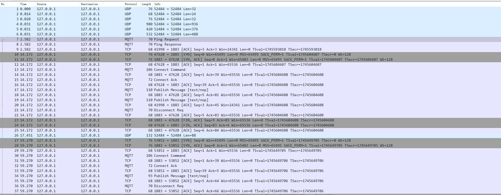
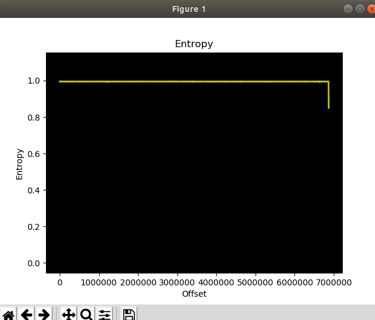
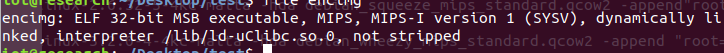
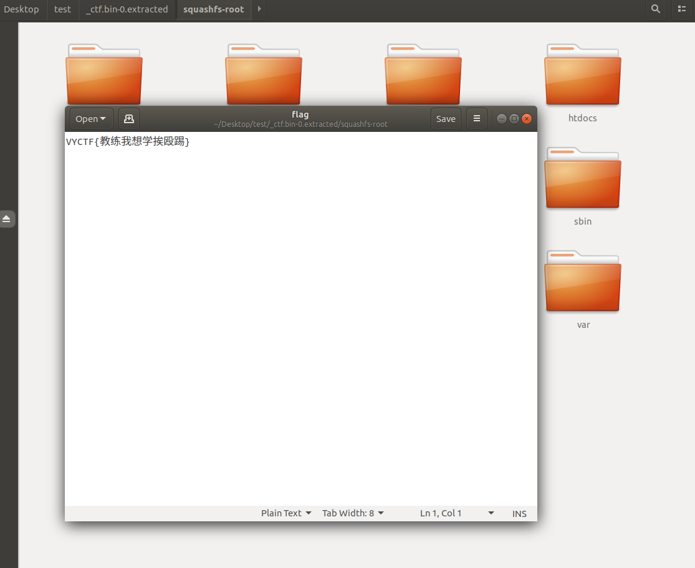

打开压缩包 里面有一个流量包和lib

用wireshark打开流量包

可以发现使用了mqtt协议通信

然后过滤出mqtt协议的流量包

其中有两个流量包大小异常

用010将文件提取出来

可以一个固件和解密程序

可以看到固件是加密的

根据流量包的提示需要用解密程序来解密这个固件

解密程序是mips架构的 我们使用qemu-mips-static来模拟

sudo chroot . ./qemu-mips-static encimg

其中-d选项是解密固件

-i指定输入固件

-s指定输出固件

密码为ProtoWare

使用命令sudo chroot . ./qemu-mips-static encimg -d -i SecretOfNop.bin -s ProtoWare

来解密固件

解密固件后即可在文件系统下找到flag

